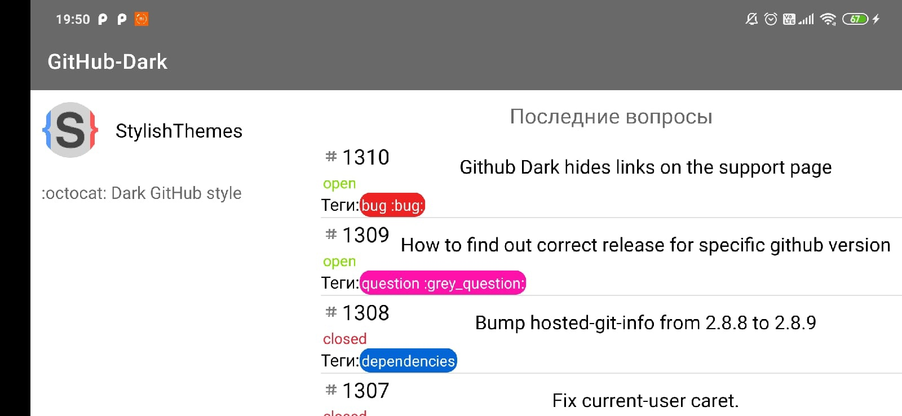

# android-github-search

## Приложение для поиска по репозиториям github.com

Окно поиска:

 

* Поиск во время печати
* Подрузка списка при скролле
* Кэширование изображений

При нажатии на элемет списка открывается окно с вопросами:

 

* Последние 30 вопросов
* Статус вопроса
* Отображение тегов
* Альтернативная разметка для горизонтального положения

 